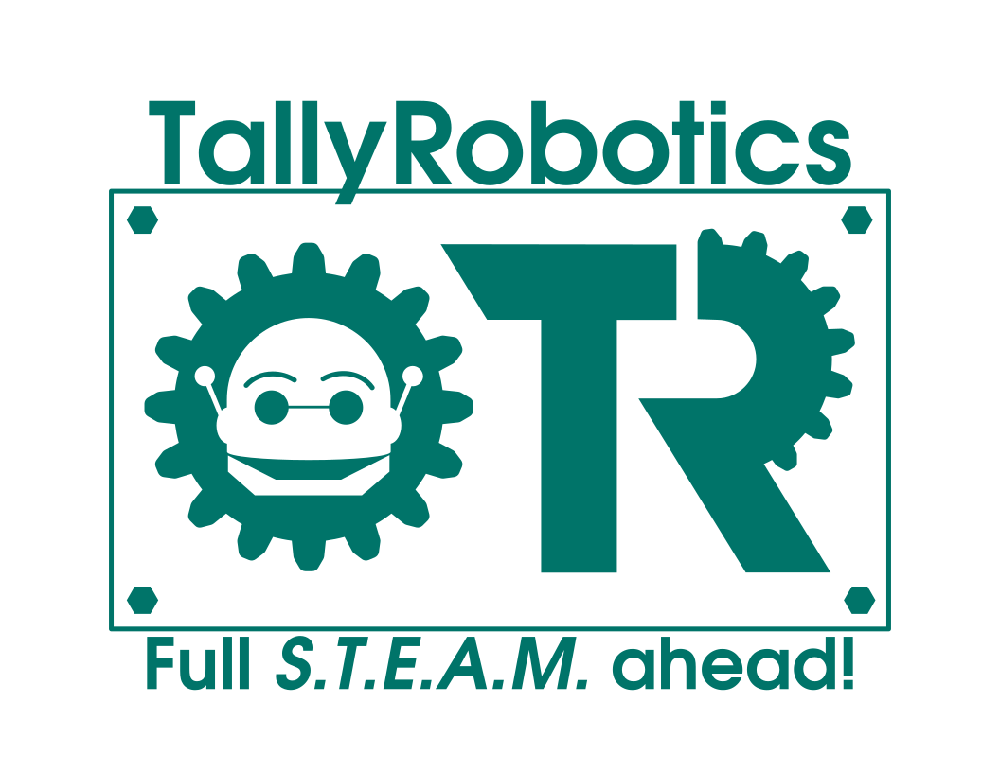

# Welcome to the 6184 Team Docs

This is a showcase of what the documentation could look like, in case anyone wants to use this outside the coding team.

## Markdown is Easily Accessible
Markdown is pretty much plaintext, I use it to write notes all the time, so I think the average person could write something and just hand it off to the code team to go put it on the website.
```
# This is a heading
## This is how you would create a small heading

Plain text is written as... plain text!
```

If you want, you can even add in images, graphs, and other things in the text as well. It should be relatively easy to have other people write stuff down if they should want to.



### Markdown Example
How this works:
```

```
Example:
```

```

---

## Conclusion
The big thing is, everything looks naturally pretty without putting much work in, and I was simply proposing that there be a *small* consideration for using this system.
I figured it would make decent training for **programmers** to do something that wasn't robot based, but still programming related to get them used to doing things outside of their comfort zone.

Programmers will be using this either way, just maybe consider using it for other parts of the team :)
